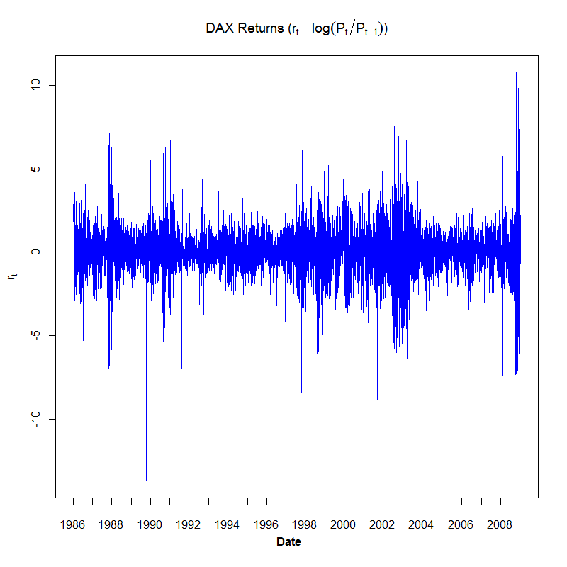

[](http://quantlet.de/index.php?p=info)

## [](http://quantlet.de/) **COPdaxreturn**[](http://quantlet.de/d3/ia)

```yaml
Name of Quantlet: COPdaxreturn
 
Published in: Copulae

Description: 'COPdaxreturn gives a DAX returns'' time series plot with a window from 1986-01-03 to 2008-12-30.'
  
Keywords: 'time-series, returns, DAX, plot, distribution, daily'

Author: Ostap Okhrin, Yafei Xu

Datafile: COPdax140624.csv

Submitted: Tue, November 18 2014 by Philipp Gschoepf

Example: Return series of the DAX.

```



```r
# replace the path of the working directory if necessary
# setwd("C:/R") 
d = read.csv("dax140624.csv")
DateInput = as.Date(d[,  1])
numOfDate = as.numeric(as.Date(c(DateInput)))
newDF = data.frame(d, numOfDate)
sortNewDF = newDF[order(newDF[, 3]), ]
newDF2 = data.frame(sortNewDF, seq(1, length(newDF[, 3]), 
                    length.out = length(newDF[, 3]))) 
sortNewDF = newDF[order(newDF[, 3]), ]
newDF2 = data.frame(sortNewDF, seq(1, length(newDF[, 3]), 
                    length.out = length(newDF[, 3])))
dateNum1 = as.numeric(as.Date(c("1986-01-02", "1987-01-02", 
                                "1988-01-04", "1989-01-02", 
                                "1990-01-02", "1991-01-02",
                      		    "1992-01-02", "1993-01-04",
								"1994-01-03", "1995-01-02",
								"1996-01-02", 
                                "1997-01-02", "1998-01-02", 
								"1999-01-04", "2000-01-03", 
								"2001-01-02", "2002-01-02", 
								"2003-01-02", 
                                "2004-01-02", "2005-01-03", 
								"2006-01-02", "2007-01-02", 
								"2008-01-02", "2008-12-30")))

At = c(newDF2[which(newDF2[, 3] == as.numeric(as.Date(c("1986-01-02")))), 4], 
       newDF2[which(newDF2[, 3] == as.numeric(as.Date(c("1987-01-02")))), 4], 
       newDF2[which(newDF2[, 3] == as.numeric(as.Date(c("1988-01-04")))), 4], 
       newDF2[which(newDF2[, 3] == as.numeric(as.Date(c("1989-01-02")))), 4], 
       newDF2[which(newDF2[, 3] == as.numeric(as.Date(c("1990-01-02")))), 4], 
       newDF2[which(newDF2[, 3] == as.numeric(as.Date(c("1991-01-02")))), 4], 
       newDF2[which(newDF2[, 3] == as.numeric(as.Date(c("1992-01-02")))), 4], 
       newDF2[which(newDF2[, 3] == as.numeric(as.Date(c("1993-01-04")))), 4], 
       newDF2[which(newDF2[, 3] == as.numeric(as.Date(c("1994-01-03")))), 4], 
       newDF2[which(newDF2[, 3] == as.numeric(as.Date(c("1995-01-02")))), 4], 
       newDF2[which(newDF2[, 3] == as.numeric(as.Date(c("1996-01-02")))), 4], 
       newDF2[which(newDF2[, 3] == as.numeric(as.Date(c("1997-01-02")))), 4], 
       newDF2[which(newDF2[, 3] == as.numeric(as.Date(c("1998-01-02")))), 4], 
       newDF2[which(newDF2[, 3] == as.numeric(as.Date(c("1999-01-04")))), 4], 
       newDF2[which(newDF2[, 3] == as.numeric(as.Date(c("2000-01-03")))), 4], 
       newDF2[which(newDF2[, 3] == as.numeric(as.Date(c("2001-01-02")))), 4], 
       newDF2[which(newDF2[, 3] == as.numeric(as.Date(c("2002-01-02")))), 4], 
       newDF2[which(newDF2[, 3] == as.numeric(as.Date(c("2003-01-02")))), 4], 
       newDF2[which(newDF2[, 3] == as.numeric(as.Date(c("2004-01-02")))), 4], 
       newDF2[which(newDF2[, 3] == as.numeric(as.Date(c("2005-01-03")))), 4], 
       newDF2[which(newDF2[, 3] == as.numeric(as.Date(c("2006-01-02")))), 4], 
       newDF2[which(newDF2[, 3] == as.numeric(as.Date(c("2007-01-02")))), 4], 
       newDF2[which(newDF2[, 3] == as.numeric(as.Date(c("2008-01-02")))), 4])
dateC = c("1986", "", "1988", "", "1990", 
          "", "1992", "", "1994", 
          "", "1996", "", "1998", "", 
		  "2000", "", "2002", "", 
		  "2004", "", "2006", "", "2008")
Pt = newDF[, 2]
P1 = Pt[-length(Pt)]
P2 = Pt[-1]
DAXreturn = log(P1/P2)
DAXreturn = data.frame(DAXreturn, length(DAXreturn):1)
DAXreturn = DAXreturn[order(DAXreturn[, 2]), ]
DAXreturn = DAXreturn[, 1]*100
# do plot
dev.new(width = 13, height = 7) 
plot(seq(1, length(DAXreturn), length.out = length(DAXreturn)),
     seq(min(DAXreturn), max(DAXreturn), length.out = length(DAXreturn)), 
     xlab = "", ylab = "",  
	 main = expression("DAX Returns ("*r[t] == log(P[t] / P[t-1])*")"), 
	 col = "White", 
     axes = FALSE,  xaxt = "n",  yaxt = "n")
box() 
axis(1, at = At, labels = F)
axis(2, at = c(-10, -5, 0, 5, 10)) 
mtext(expression(r[t]),  side = 2,  line = 2.7,  at = seq(min(DAXreturn),
      max(DAXreturn), length.out = 13)[7], font = 2, cex = 1)  
mtext("Date", side = 1, line = 2.7, at = 2800, font = 2, cex = 1) 
text(cex = 1, x = At - 10, y = -16.3, dateC, xpd = TRUE) 
# time series plot
lines(1:length(DAXreturn), DAXreturn, pch = 1, lty = 1,
      col = "blue", lwd = 1) 
```
