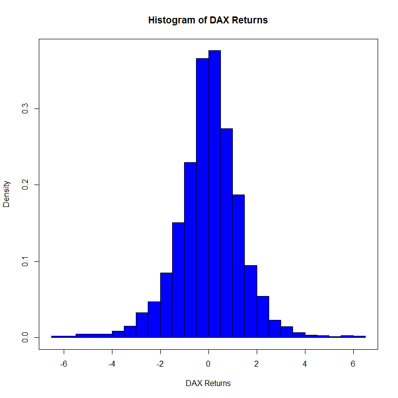

[](http://quantlet.de/index.php?p=info)

## [](http://quantlet.de/) **COPdaxreturnhist**[](http://quantlet.de/d3/ia)

```yaml
Name of Quantlet: COPdaxreturnhist
 
Published in: Copulae

Description: 'COPdaxreturn gives a DAX returns'' time series plot with a window from 1986-01-03 to 2008-12-30.'
  
Keywords: density, histogram, plot, returns, DAX
     
See also: COPdaxtimeseries, COPdensitydaxreturn

Author: Ostap Okhrin, Yafei Xu

Datafile: COPdax140624.csv

Submitted: Thu, November 13 2014 by Sergey Nasekin
     
Output: COPdaxreturnhist gives a histogram of DAX returns

Example: a histogram of DAX returns

```



### R Code:
```r
# replace the path of the working directory if necessary
# setwd("C:/R") 
d         = read.csv("COPdax140624.csv") # pls download the pertinent data set.
DateInput = as.Date(d[, 1])
numOfDate = as.numeric(as.Date(c(DateInput)))
newDF     = data.frame(d, numOfDate)
sortNewDF = newDF[order(newDF[, 3]), ]
newDF2    = data.frame(sortNewDF, seq(1, length(newDF[, 3]), 
                    length.out = length(newDF[, 3])))
Pt        = newDF[, 2]
P1        = Pt[ - length(Pt)]
P2        = Pt[ - 1]
DAXreturn = log(P1 / P2)
DAXreturn = data.frame(DAXreturn, length(DAXreturn):1)
DAXreturn = DAXreturn[order(DAXreturn[, 2]), ]
DAXreturn = DAXreturn[, 1] * 100
r         = DAXreturn[- which(DAXreturn >= 6.5|DAXreturn <= - 6.5)]

# do plot
hist(r, prob = TRUE, 12, main = "Histogram of DAX Returns",
     col = "Blue", freq = F, breaks  =  24,
	 xlab = "DAX Returns") 
box()
```
