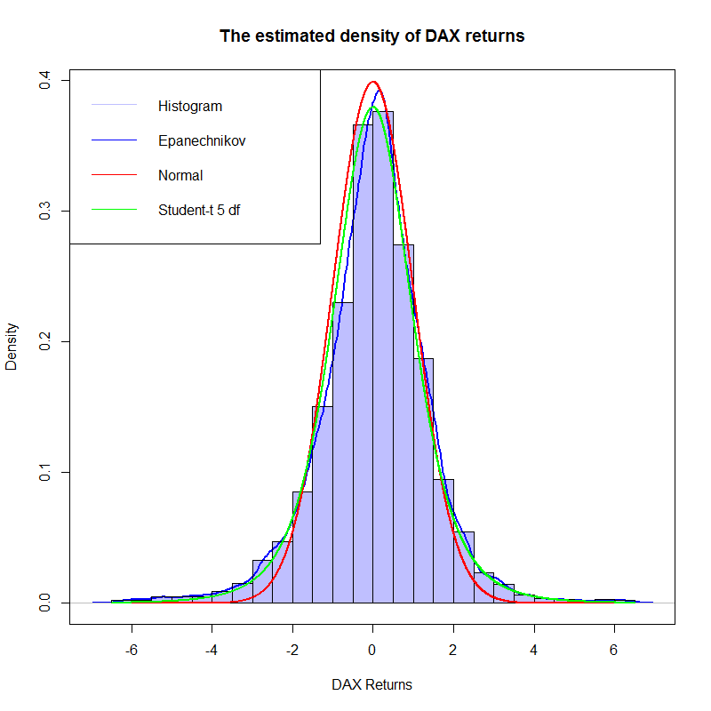

[](http://quantlet.de/index.php?p=info)

## [](http://quantlet.de/) **COPdensitydaxreturn**[](http://quantlet.de/d3/ia)

```yaml
Name of Quantlet: COPdensitydaxreturn
 
Published in: Copulae

Description: 'COPdensitydaxreturn gives the DAX histogram compared to the 3 
densities including the standard normal density in red, the Student-t density
in green with degrees of freedom equal to 5 and the estimated Epanechnikov 
kernel density in blue with the bandwidth computed following that 0.9 times 
the minimum of the standard deviation and the interquartile range divided by
1.34 times the sample size to the negative one-fifth power, i.e. Silverman''s
rule-of-thumb.'
  
Keywords: Epanechnikov, density, histogram, normal, student, kernel

See also: COPdaxhistogram, COPdaxreturnhist, COPdaxtimeseries

Author: Ostap Okhrin, Yafei Xu

Datafile: COPdax140624.csv

Submitted: Mon, November 03 2014 by Felix Jung
     
Output: 'COPdensitydaxreturn gives the DAX histogram compared to the 3 
theoretical densities including normal, Student-t and Epanechnikov.'


```



### R Code:
```r
rm(list = ls(all = TRUE))
#setwd("C:/...") # please change your working directory
d         = read.csv("COPdax140624.csv") # pls download the pertinent data set.
DateInput = as.Date(d[, 1])
numOfDate = as.numeric(as.Date(c(DateInput)))
newDF     = data.frame(d, numOfDate)
sortNewDF = newDF[order(newDF[, 3]), ]
newDF2    = data.frame(sortNewDF, seq(1, length(newDF[, 3]),
                       length.out = length(newDF[, 3])))
Pt        = newDF[, 2]
P1        = Pt[ - length(Pt)]
P2        = Pt[ - 1]
DAXreturn = log(P1/P2)
DAXreturn = data.frame(DAXreturn, length(DAXreturn) : 1)
DAXreturn = DAXreturn[order(DAXreturn[, 2]), ]
DAXreturn = DAXreturn[, 1] * 100
r         = DAXreturn[ - which(DAXreturn >= 6.5 | DAXreturn <= - 6.5)]

# kernel density,  normal samples and t samples
epaDensity = density(r, bw = "nrd0", kernel = c("epanechnikov"))
dNorm = dnorm(seq(-6.5, 6.5, length.out = length(r)), mean = 0, sd = 1)
dT = dt(seq(-6.5, 6.5, length.out = length(r)), df = 5)		

# do plot
hist1 = hist(r, prob = TRUE, 12, main = "Histogram of DAX Return", 
             col = "lightblue", freq = F, breaks = 24) 

# kernel density estimation
plot(epaDensity, col = "Blue", lwd = 2, xlab = "DAX Returns", ylab = "Density", 
     main = "The estimated density of DAX returns")
plot(hist1, col = rgb(0, 0, 1, 1/4), xlim = c(-6, 6), 
     freq = F, add = T) 
lines(seq(-6.5, 6.5, length.out = length(r)), dNorm, 
      col = "Red", lwd = 2)
lines(seq(-6.5, 6.5, length.out = length(r)), dT,  
      col = "Green", lwd = 2)
legend("topleft", c("Histogram", "Epanechnikov", "Normal", "Student-t 5 df"),
       lty = 1, col = c(rgb(0, 0, 1, 1/4), "Blue", "Red", "Green"))
box()
```
