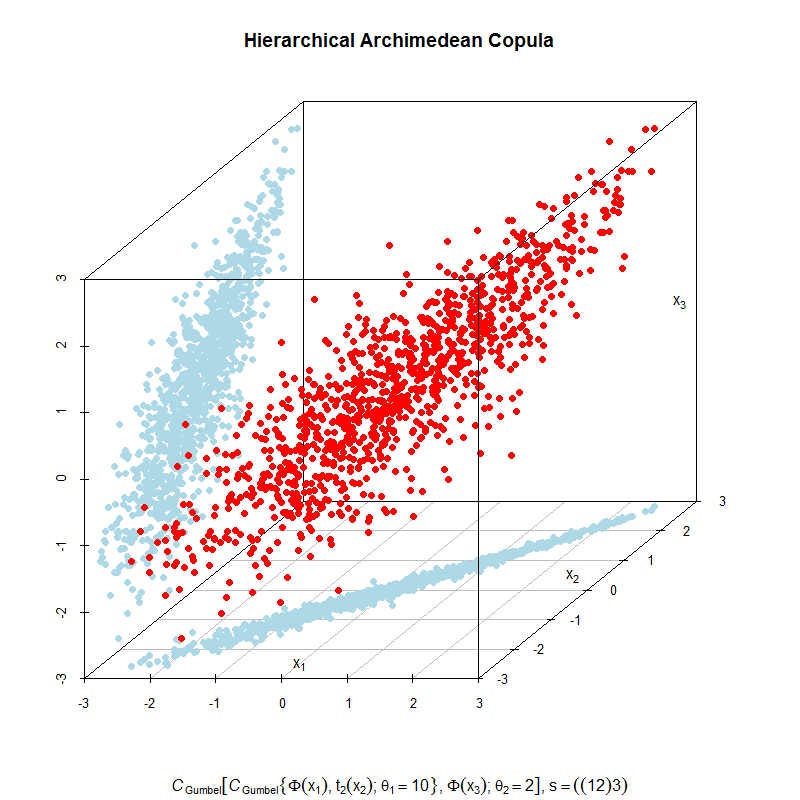

[](http://quantlet.de/)

## [](http://quantlet.de/) **COPhac3dscatter1** [](http://quantlet.de/)

```yaml

Name of Quantlet : COPhac3dscatter1

Published in : Copulae

Description : 'COPhac3dscatter1 gives samples generated from an HAC copula, where the red points
stands for the 1100 scatter points drawn from the hierarchical Archimedean copula. In this case we
use a Gumbel generator function and the marginals contain a Student-t for variabel x2, the normal
for variable x1 and also the normal for x3. The parameter for x1 and x2 in the first hierarchy is
10 and in the second hierarchy the parameter is 2. The blue points on the vertical plane stand for
the projection of the red points onto the plane x1 and x3. The blue points on the bottom plane
stand for the projection of the red points onto the plane x1 and x2.'

Keywords : HAC, copula, gumbel, scatterplot, 3D, Archimedean

Author : Ostap Okhrin, Yafei Xu

Datafile : COPdax140624.csv

Submitted : Mon, November 03 2014 by Felix Jung

Output : COPhac3dscatter1 gives a 3D scatter plot with samples generated from an HAC copula.

```




### R Code:
```r
rm(list = ls(all = TRUE))
#setwd("C:/...") # please change your working directory
# install packages
# install.packages("copula")
library(copula)
# install.packages("scatterplot3d")
library(scatterplot3d)
set.seed(12345)

# draw sample from HAC
theta1 = 10
theta2 = 2
C3     = onacopula("G", C(theta2, 3, C(theta1, c(1, 2))))
U      = rCopula(1100, C3)
x1     = qnorm(U[, 1])
x2     = qt(U[, 2], df = 20)
x3     = qnorm(U[, 3])
d      = data.frame(x1, x2, x3)
d      = d[-which(d[, 1] > 3 | d[, 1] < -3), ]
d      = d[-which(d[, 2] > 3 | d[, 2] < -3), ]
d      = d[-which(d[, 3] > 3 | d[, 3] < -3), ]

# do plot 
dev.new(width = 14, height = 14)
s3d = scatterplot3d(d[, 1], d[, 2], d[, 3], 
                    main = "Hierarchical Archimedean Copula", 
					pch = 16, zlab = "", ylab = "", xlab = "",
					sub = expression(italic(C)[Gumbel] * group("[", 
					                 italic(C)[Gumbel] * group("{", 
									 Phi(x[1]) * ", " * t[2](x[2]) *
									 "; " * theta[1] == 10, "}") *
									 ", " * Phi(x[3]) * "; " *
									 theta[2] == 2,"]") *
									 ", " * s == ((1 * 2) * 3)))

s3d$points3d(d[, 1], d[, 2], seq(min(floor((d[, 3]))), 
             min(floor((d[, 3]))), length.out = length(d[, 3])),
			 col = "lightblue", pch = 16)
s3d$points3d(seq(min(floor((d[, 1]))), min(floor((d[, 1]))), 
             length.out = length(d[, 3])), d[, 2], d[, 3], 
			 col = "lightblue", pch = 16)
s3d$points3d(d[, 1], d[, 2], d[, 3], col = "red", pch = 16)
text(s3d$xyz.convert(0, -2.5, -3),
labels = expression(x[1]))
text(s3d$xyz.convert(2.5, 0.5, -3),
labels = expression(x[2]))
text(s3d$xyz.convert(2.75, 3, 0),
labels = expression(x[3]))
s3d$box3d()
```
