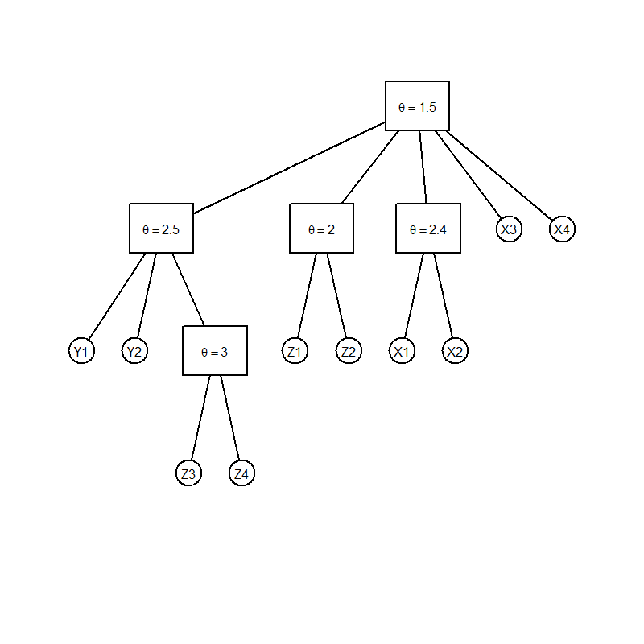

[](http://quantlet.de/)

## [](http://quantlet.de/) **COPhac4firmstree4** [](http://quantlet.de/)

```yaml

Name of Quantlet : COPhac4firmstree4

Published in : Copulae

Description : 'COPhac4firmstree4 is used to give a tree plot of a 10-dim HAC, where the Gumbel
generator is used. The parameter for Z3 and Z4 is 3 and for (Y1, Y2, (Z3, Z4)) is 2.5. The
parameter for Z1 and Z2 is 2, and for X1 and X3 is 2.4. The parameter for ((Y1, Y2, (Z3, Z4)), (Z1,
Z2), (X1, X2), X3, X4) is 1.5.'

Keywords : HAC, copula, gumbel, firms, tree

Author : Ostap Okhrin, Yafei Xu

Datafile : CopTreeFile

Submitted : Tue, November 18 2014 by Philipp Gschoepf

Example : Example of a tree

```




### R Code:
```r
rm(list = ls(all = TRUE))
#install.packages("HAC")
library(HAC)
G3 = hac(type = 1,
         tree = list(list("Y1", "Y2",
                     list("Z3", "Z4", 3), 2.5),
                     list("Z1", "Z2", 2),
                     list("X1", "X2", 2.4),
                     "X3", "X4", 1.5) )
# do plot
plot(G3)


```
