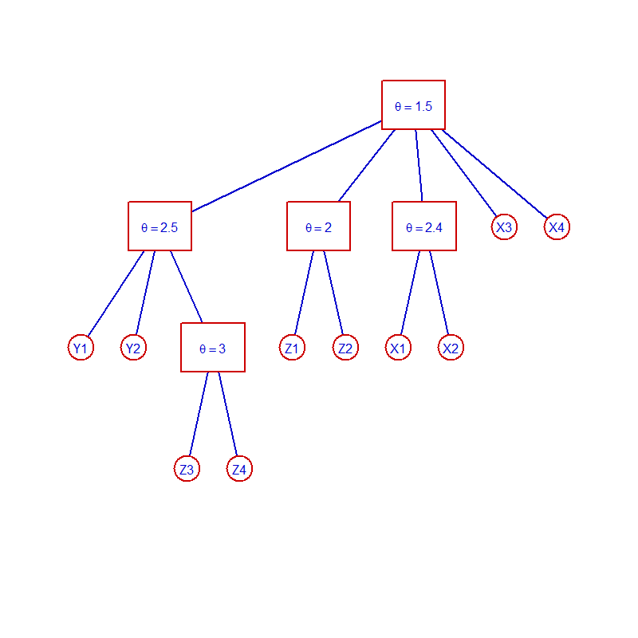

[](http://quantlet.de/)

## [](http://quantlet.de/) **COPhac4firmstree5** [](http://quantlet.de/)

```yaml

Name of Quantlet : COPhac4firmstree5

Published in : Copulae

Description : 'COPhac4firmstree5 is used to give a tree plot of a 10-dim HAC, where the Gumbel
generator is used. The parameter for Z3 and Z4 is 3 and for (Y1, Y2, (Z3, Z4)) is 2.5. The
parameter for Z1 and Z2 is 2, and for X1 and X3 is 2.4. The parameter for ((Y1, Y2, (Z3, Z4)), (Z1,
Z2), (X1, X2), X3, X4) is 1.5. The difference from COPhac4firmstree4 is employing colours, red for
frames and blue for expressions and lines for knots.'

Keywords : HAC, copula, gumbel, firms, tree

See also : COPhac4firmstree6

Author : Ostap Okhrin, Yafei Xu

Datafile : CopTreeFile

Submitted : Tue, November 06 2014 by Sergey Nasekin

Output : COPhac4firmstree5 returns a tree plot of a 10-dim HAC

Example : A tree plot of a 10-dim HAC

```




### R Code:
```r
rm(list = ls(all = TRUE))
#install.packages("HAC")
library(HAC)
G3 = hac(type = 1,
         tree = list(list("Y1", "Y2",
                     list("Z3", "Z4", 3) , 2.5) ,
                     list("Z1", "Z2", 2) ,
                     list("X1", "X2", 2.4) ,
                     "X3", "X4", 1.5) )
# do plot
plot(G3 , digits = 2, theta = TRUE ,
     col = " blue3 ", fg = " red3 ",
     bg = " white ", col.t = " blue3 ")
```
