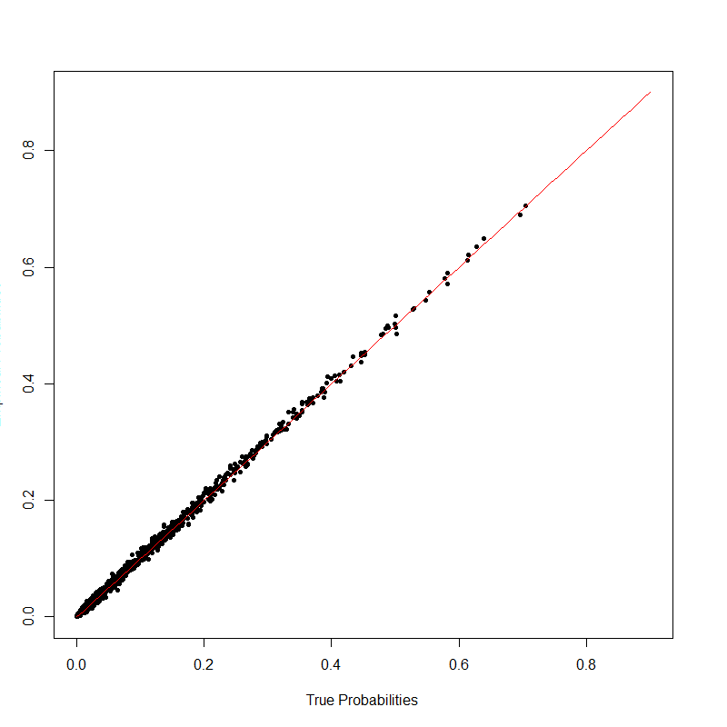

[](http://quantlet.de/index.php?p=info)

## [](http://quantlet.de/) **MVApcapfresults** [](http://quantlet.de/d3/ia)

```yaml
Name of Quantlet: COPhac5pp
 
Published in:     Copulae

Description:     'COPhac5pp gives a plot of theoretical probabilities against empirical probabilities under the context
                  of a 5-dim HAC. Here the Gumbel generator is used. The parameter for X3, X4, X4 equals 2.005 and for
                  ((X3, X4, X5), X2, X1) is 1.005. Here 1500 random numbers have been drawn from the aforementioned HAC
                  and this sample then will be computed to obtain the theoretical probabilities and the empirical 
                  probabilities. Hence for every drawn random number there exist a theoretical probability and an
                  empirical probability. We plot for every such pair in black points in the figure and at last a line 
                  is fitted according to all the scatter points in red.'
  
Keywords:         HAC, cdf, copula, gumbel, probability

See also:         COPhac4firmstree5

Author:           Ostap Okhrin, Yafei Xu

Submitted:        Mon, November 03 2014 by Felix Jung
     
Output:          'COPhac5pp returns a plot of theoretical probabilities against empirical probabilities under the context
                  of a 5-dim HAC.'


Example:        'A tree plot of a 5-dim HAC.'


```



```r
# install.packages(c("HAC")) # run this line to install necccesary package
rm(list = ls(all = TRUE))
# setwd("C: / ...") # please change your working directory
library(HAC)
G2 = hac(type = 1, tree = list(list ("X3", "X4", "X5", 2.005),
                               "X2", "X1", 1.005))
sample = rHAC(n = 1500 , hac = G2)
# compute sample's theoretical probability
cf.values = pHAC(X = sample , hac = G2)
# compute sample's empirical probability
ecf.values = emp.copula.self(x = sample, proc = "M", 
                             sort = "none", na.rm = FALSE)
# do plot
True_Probabilities = Empirical_Probabilities = seq(0, .9, length.out = 100)
plot(True_Probabilities, Empirical_Probabilities, col = "white",
     xlab = "True Probabilities", ylab = "Empirical Probabilities")
points(cf.values, ecf.values, pch = 20, col = "black")
lines(True_Probabilities, Empirical_Probabilities, col = "red")
```
