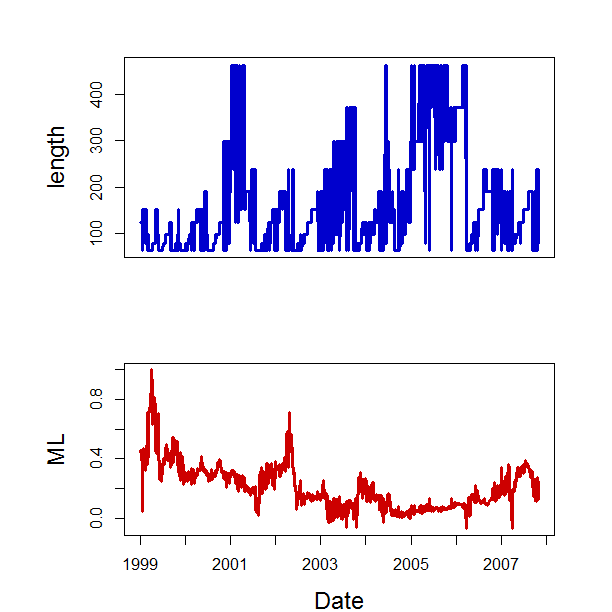
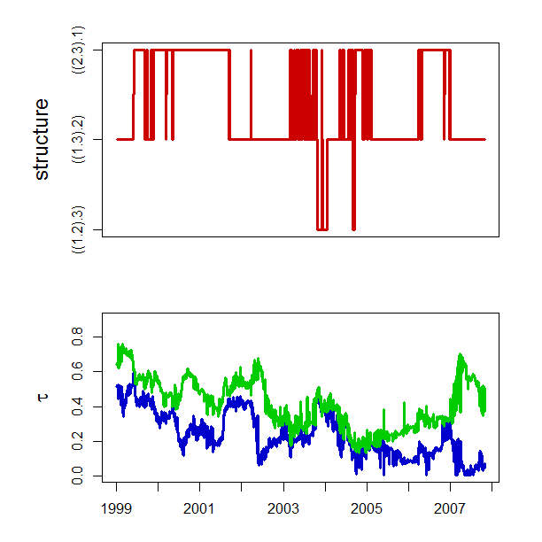
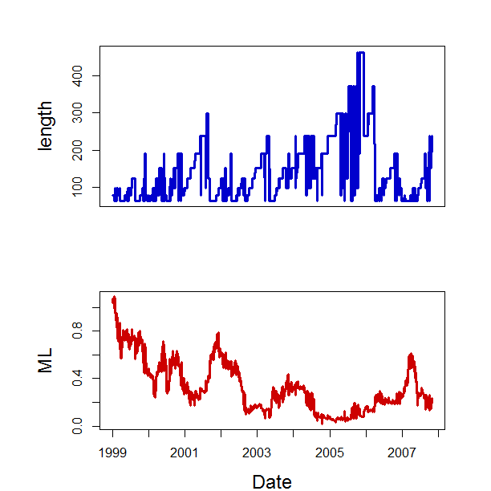
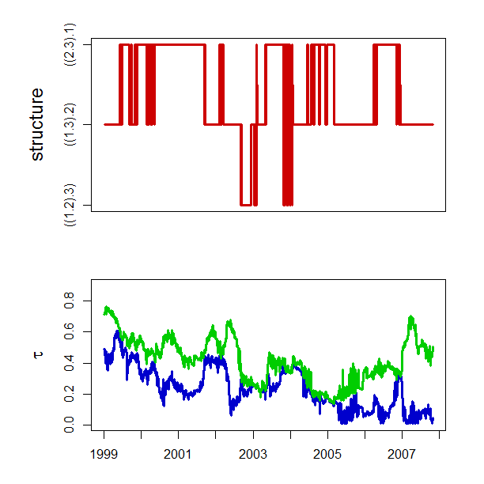

[](http://quantlet.de/index.php?p=info)

## [](http://quantlet.de/) **COPlcpexres**[](http://quantlet.de/d3/ia)

```yaml
Name of Quantlet: COPlcpexres
 
Published in: Copulae

Description: 'COPlcpexres computes from the results of fitting a Garch(1,1) model to daily 
returns, see COPlcpexgarch, when which copula fits the data best. Used are Gumbel and Clayton
copula.'
  
Keywords: HAC, clayton, gumbel, garch, daily returns

See also: COPhelperfunctions, COPlcpeinaparch, COPlcpexVaR, COPlcpexgarch, COPlcpinVaR, COPlcpinres, CRIXbic

Author: Ostap Okhrin, Simon Trimborn

Datafile: COPclayton.dat, COPgumbel.dat, COPts2dates.dat, COPts2feps.dat

Submitted: Tue, October 07 2014 by Felix Jung

Output: 'The Quantlet returns plots which show the structure, the taus on the intervals of 
homogeneity, the intervals of homogeneity and the ML on these intervals.'

```






### R Code:
```r
rm(list=ls(all=TRUE))

# install.packages("fGarch")
# install.packages("copula")
library(fGarch)
library(copula)

#setwd("C:/...")        # please change your working directory

GAUSS      = "gauss"
GUMBELHAC  = "gumbelHAC"
GUMBELAC   = "gumbelAC"
CLAYTONHAC = "claytonHAC"
CLAYTONAC  = "claytonAC"

source("COPhelperfunctions.R")

feps  = read.table("COPts2feps")
dates = read.table("COPts2dates")
dates = as.matrix(dates)


################## LCP ############################
taus   = c(0.1, 0.3, 0.5, 0.7)
m0LCP  = 40
cLCP   = 1.25
Ak_max = 10
r      = 0.5
rho    = 0.5
conv.str = function(st){
  if(st == "((1.2).3)"){
    a = 1
    }
  if(st == "((1.3).2)"){
    a = 2
    }
  if(st == "((2.3).1)"){
    a = 3
    }
  a
}
get.str = function(st){
  if(st == 1){
    a = "((1.2).3)"
    }
  if(st == 2){
    a = "((1.3).2)"
    }
  if(st == 3){
    a = "((2.3).1)"
    }
  a
}
skip = round(m0LCP * cLCP^(Ak_max + 1)) + 1


Gu            = feps
samplesize    = dim(Gu)[1]
copula.in.use = "gumbel"
qx            = read.table("COPgumbel")
AGumbel       = make.crit.val(u = Gu, copula_typeL = copula.in.use)
#### LCP for Clayton
Gu            = feps
samplesize    = dim(Gu)[1]
copula.in.use = "clayton"
qx            = read.table("COPclayton")
AClayton      = make.crit.val(u = Gu, copula_typeL = copula.in.use)

give.sigma.tau = function(A, copula.in.use){
sigma_tau      = 0
  for(step in 1:dim(A)[1]){
    Lfeps = feps[(skip + step - A[step, 1] + 1):(skip + step),]
    pair  = if(A[step, 2]==1){
      c(1, 2)
      } else if(A[step, 2]==2){
        c(1, 3)
        } else if(A[step, 2]==3){
          c(2, 3)
          }
  sigma_tau2 = sqrt(abs(16 * var(2 * emp.copula.self.2d(Lfeps[, pair]) - 
    Lfeps[,pair[1]] - Lfeps[, pair[2]]))) / sqrt(A[step, 1]) * z_alpha
  Lfeps      = cbind(cop2d(Lfeps[, pair[1]], Lfeps[, pair[2]], A[step, "theta2"],
  Ltype      = copula.in.use), Lfeps[, setdiff(1:3,pair)])
  sigma_tau1 = sqrt(abs(16 * var(2 * emp.copula.self.2d(Lfeps) - Lfeps[, 1] - 
    Lfeps[, 2]))) / sqrt(A[step, 1]) * z_alpha
  sigma_tau  = rbind(sigma_tau, c(sigma_tau1, sigma_tau2))
    print(step)
  }
  sigma_tau = sigma_tau[-1,]
}
sigma_tauG = give.sigma.tau(AGumbel, "gumbel")
sigma_tauC = give.sigma.tau(AClayton, "clayton")

labels    = as.numeric(format(as.Date(dates, "%d.%m.%Y"), "%Y"))
where.put = c(1, which(diff(labels) == 1) + 1)

plot.COP = function(A, sigma_tau, copula.in.use){
  dev.new()
  layout(matrix(1:2, nrow = 2, byrow = T))

  par(mai = (c(0.0, 0.8, 0.1, 0.1) + 0.4))
  plot(c(0,0), c(0,0), xlim = c(0, length(A[, 1])), ylim = c(1, 3), xlab = "",
    ylab = "structure", axes = F, frame = T, cex.lab = 1.5, cex.axis = 1.2)
  lines(A[, 2], type = "l", lwd = 3, col = "red3")
  axis(2, at = 1:3, labels = c(get.str(1), get.str(2), get.str(3)))

  par(mai = (c(0.3, 0.8, 0.1, 0.1) + 0.4))
  plot(theta2tau(A[, 3], copula.in.use), ylim = c(0, 0.9), type = "l", lwd = 3,
    col = "blue3", lty = "solid", axes = F, frame = T, xlab = "",
    ylab = expression(tau), cex.lab = 1.5, cex.axis = 1.2)

  lines(theta2tau(A[, 3], copula.in.use), lwd = 3, col = "blue3", lty = "solid")
  lines(theta2tau(A[, 4], copula.in.use), lwd = 3, col = "green3", lty = "solid")

  axis(2)
  axis(1, at = where.put, labels = labels[where.put])

  dev.new()
  layout(matrix(1:2, nrow = 2, byrow = T))
  par(mai = (c(0.0, 0.8, 0.1, 0.1) + 0.5))    
  plot(A[, 1], type = "l", lwd = 3, col = "blue3", lty = "solid", axes = F,
    frame = T, xlab = "Date", ylab = "length", cex.lab = 1.5, cex.axis = 1.2)
  axis(2)

  par(mai = (c(0.3, 0.8, 0.1, 0.1) + 0.5))    
  plot(A[, 5], type = "l", lwd = 3, col = "red3", lty = "solid", axes = F,
    frame = T, xlab = "Date", ylab = "ML", cex.lab = 1.5, cex.axis = 1.2)
  axis(2)
  axis(1, at = where.put, labels = labels[where.put])

}

plot.COP(AGumbel, sigma_tauG, "gumbel")
plot.COP(AClayton, sigma_tauC, "clayton")
```
