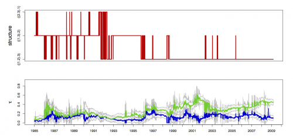
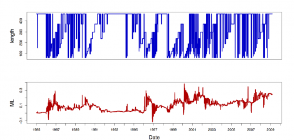
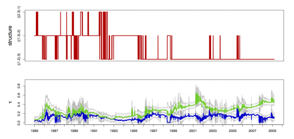
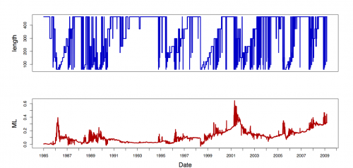

[](http://quantlet.de/index.php?p=info)

## [](http://quantlet.de/) **COPlcpinVaR**[](http://quantlet.de/d3/ia)

```yaml
Name of Quantlet: COPlcpinVaR
 
Published in: Copulae

Description: 'COPlcpinVaR computes from the results of fitting a Aparch(1, 1) model to daily returns,
see COPlcpinaparch, and choosing the HAC model, see COPlcpinres, the profit and loss function (dots)
with the 99%-VaR bound (solid line) and the time points of the exceedances (pluses).'
  
Keywords: HAC, clayton, gumbel, aparch, daily returns

See also: COPlcpeinaparch, COPlcpexVaR, COPlcpexgarch, COPlcpexres, COPlcpinres

Author: Ostap Okhrin, Simon Trimborn

Datafile: 'COPts1AClayton.dat, COPts1AGumbel.dat, COPts1dates.dat, COPts1eps.dat, COPts1parameters.dat,
COPts1sigmat.dat, cop_timeseries_1.dat'

Submitted: Tue, October 07 2014 by Felix Jung

Input: COPhelperfunctions
     
Output: 'The Quantlet returns plots which show the profit and loss function (dots) for index data with
the 99%-VaR bound (solid line) and the time points of the exceedances (pluses) for the HAC model
with Gumbel and Clayton generators.'

Example: 'The example is performed for the indizes DAX, DJ and NIKKEI in the time span [1.1.1985; 23.12.2010]
using the Clayton (first two graphs) and the Gumbel copula (second two graphs).'


```






### R Code:
```r
rm(list=ls(all=TRUE))

# install.packages("copula")
library(copula)

#setwd("C:/...")        # please change your working directory

source("COPhelperfunctions.R")

X = read.csv("cop_timeseries_1.dat", header = T, sep = ";", dec=",")
X = X[, -1] 
R = apply(log(X), 2, diff)

dates = read.table("COPts1dates.dat")
dates = as.matrix(dates)

# results from the Quantlets COPlcpexgarch and COPlcpexres
COPAGumbel  = read.table("COPts1AGumbel.txt", header = T, sep = " ", dec = ".", 
                         row.names = NULL)
COPAGumbel  = COPAGumbel[,-1]
COPAClayton = read.table("COPts1AClayton.txt", header = T, sep = " ", dec = ".", 
                         row.names = NULL)
COPAClayton = COPAClayton[,-1]
eps         = read.table("COPts1eps.dat")
COPsigma.t  = read.table("COPts1sigmat.dat")
COPparams   = read.table("COPts1parameters.dat", header = T, 
  row.names = c("DAX", "DAXsigma", "DJ", "DJsigma", "NIKKEI", "NIKKEIsigma"))
COPparams   = COPparams[-1]

skip        = 467 # value results from the quantlet COPlcpinres

sim         = 1000
portfolios  = 100
w           = rbind(c(1, 1, 1), matrix(runif((portfolios - 1) * 3), ncol = 3))
w           = w / matrix(rep(rowSums(w), 3), ncol = 3)
portfolios  = dim(w)[1]
l.quantiles = c(0.01, 0.05, 0.1)

doVaR = function(){
s.eps = 0
length.data = dim(COPAClayton)[1]
## simulation of residuals
for(l in 1:length.data){
  l <<- l
  if(copula.in.use == "clayton"){
    u = rnacopula(sim, onacopula("C", C(copClayton@iTau(theta2tau(
      COPAClayton[l, "theta1"], copula.in.use)), 3, C(copClayton@iTau(
      theta2tau(COPAClayton[l, "theta2"], copula.in.use)), c(1, 2)))))
    if(COPAClayton[l, "structure"] == 2){
      u = u[, c(1, 3, 2)]
    } else if(COPAClayton[l, "structure"] == 3){
      u = u[, c(3, 2, 1)]
    }
  } else if(copula.in.use == "gumbel"){
    u = rnacopula(sim, onacopula("C", C(copGumbel@iTau(theta2tau(
      COPAGumbel[l, "theta1"], copula.in.use)), 3, C(copGumbel@iTau(
      theta2tau(COPAGumbel[l, "theta2"], copula.in.use)), c(1, 2)))))
    if(COPAGumbel[l, "structure"] == 2){
      u = u[, c(1, 3, 2)]
    } else if(COPAGumbel[l, "structure"] == 3){
      u = u[, c(3, 2, 1)]
    }
  }
  s.eps = rbind(s.eps, rbind(quantile(eps[, 1], probs = u[, 1]), 
    quantile(eps[, 2], probs = u[, 2]), quantile(eps[, 3], probs = u[, 3])))
  if(copula.in.use == "clayton"){
    print(paste(l, "/", dim(COPAClayton)[1]))
  } else if(copula.in.use == "gumbel"){
    print(paste(l, "/", dim(COPAGumbel)[1]))
  }
}
s.eps = s.eps[-1,]

## calculation of simulated returns (eps + GARCH(1,1) + F^{-1})
VaRs = list()
for(j in 1:portfolios){
  for(i in 1:sim){
    R.new = X[skip:(dim(COPsigma.t)[1] - 1),] * (exp(matrix(rep(
      COPparams[c(1, 3, 5), "mu"], each = length.data), ncol = 3) + 
      COPsigma.t[(skip + 1):dim(COPsigma.t)[1],] * matrix(s.eps[, i], 
      ncol = 3, byrow = TRUE)) - 1)
    if(i == 1){
      res = rowSums(R.new * matrix(rep(w[j,], each = dim(R.new)[1]), ncol = 3))
    } else{
      res = cbind(res, rowSums(R.new * matrix(rep(w[j,], each = dim(R.new)[1]), 
        ncol = 3)))
    }
  }
  VaRs[[j]] = t(apply(res, 1, quantile, prob = l.quantiles))
  print(paste(j, "/", portfolios))
}

## true PL function
L = matrix(0, dim(R)[1], portfolios)
for(j in 1:portfolios)
  L[,j] = as.vector(rowSums(matrix(rep(w[j,], each = (dim(R)[1])), ncol = 3) * X[-1,]*(exp(R)-1)))

L = tail(L, length.data)

## actually VaRs
res.VaRs = 0
for(j in 1:portfolios){
  res.VaRs = rbind(res.VaRs, colSums(VaRs[[j]] > matrix(rep(L[, j], 
    length(l.quantiles)), ncol = 3)))
}
res.VaRs = res.VaRs[-1,]
res.VaRs = res.VaRs / length.data

dev.new()
labels    = as.numeric(format(as.Date(dates, "%d.%m.%Y"), "%Y"))
where.put = c(1, which(diff(labels) == 1) + 1)

par(mai = c(0.5, 0.8, 0.1, 0.3) + 0.3)
ylimL                                = range(rbind(L[, 1], VaRs[[1]][, 1]))
Lmod                                 = L[, 1]
Lmod[Lmod < VaRs[[1]][, 1]]          = min(ylimL)
pchL                                 = rep(19, length(Lmod))
pchL[which(L[, 1] < VaRs[[1]][, 1])] = 3
plot(Lmod, pch = pchL, col = "black", lty = "solid", axes = F, frame = T, 
  xlab = "Date", ylab = "PL", cex.lab = 1.5, cex.axis = 1.2, ylim = ylimL) 
lines(VaRs[[1]][, 1], col = "red3", lwd = 2)
axis(2)         
axis(1, at = where.put, labels = labels[where.put])   
}

copula.in.use = "gumbel"
doVaR()
copula.in.use = "clayton"
doVaR()
```
